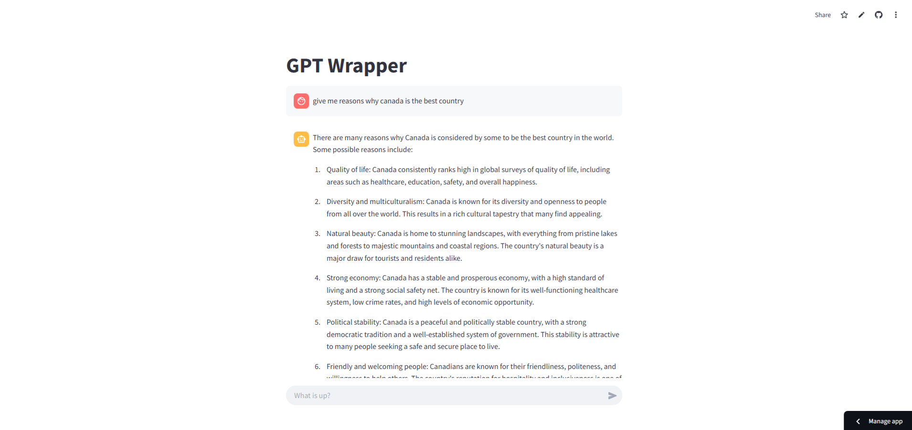

# AI Chatbot with GPT Integration

A simple and interactive chatbot application built with Streamlit and OpenAI's GPT model. This project demonstrates how to create a user-friendly chat interface that leverages the power of GPT for natural language conversations.

## Features

- Clean and intuitive chat interface
- Real-time streaming responses from GPT
- Session state management for persistent chat history
- Modern UI with Streamlit components
- Support for GPT-3.5-turbo model

## Prerequisites

Before running this application, make sure you have:

- Python 3.x installed
- An OpenAI API key
- Git (optional, for cloning the repository)

## Installation

1. **Clone or Download the Repository**
   ```bash
   git clone https://github.com/ShanemelAsuncion/ai-chatbot.git
   cd ai-chatbot
   ```

2. **Create a Virtual Environment**
   ```bash
   python -m venv myenv
   myenv\Scripts\activate  # On Windows
   ```

3. **Install Required Packages**
   ```bash
   pip install streamlit openai
   ```

4. **Configure OpenAI API Key**
   - Create a `.streamlit` folder in your project directory
   - Create a `secrets.toml` file inside the `.streamlit` folder
   - Add your OpenAI API key:
     ```toml
     OPENAI_API_KEY = "your-api-key-here"
     ```

## Project Structure

```
ai-chatbot/
├── .streamlit/
│   └── secrets.toml
├── pages/
│   └── chat.py
├── home.py
├── .gitignore
├── requirements.txt
└── README.md
```

## Usage

1. **Start the Application**
   ```bash
   streamlit run home.py
   ```

2. **Access the Chat Interface**
   - Open your web browser
   - Navigate to the local URL provided by Streamlit (typically http://localhost:8501)
   - Use the chat interface to start conversing with the AI

## UI



- Modern UI built with Streamlit

## RAG-Enhanced Chatbot

The RAG (Retrieval Augmented Generation) version of the chatbot provides intelligent responses based on your uploaded documents. This implementation combines the power of OpenAI's language models with Pinecone's vector database for efficient document retrieval.

### How It Works

1. **Document Processing**:
   - Upload PDF documents through the user interface
   - Documents are split into smaller chunks while preserving context
   - Each chunk is converted into a vector embedding using OpenAI's embedding model
   - Embeddings are stored in a Pinecone vector database for efficient retrieval

2. **Query Processing**:
   - When you ask a question, it's converted into a vector embedding
   - The system searches Pinecone for the most relevant document chunks
   - Retrieved chunks provide context for OpenAI's GPT model
   - The model generates a response based on the relevant context

3. **Features**:
   - Upload multiple PDF documents
   - Real-time document processing
   - Context-aware responses
   - Source tracking for transparency
   - Interactive chat interface
   - View source documents for each response

### Usage

1. **Setup**:
   ```bash
   # Install dependencies
   pip install -r requirements.txt
   ```

2. **Configuration**:
   Create a `.streamlit/secrets.toml` file with your API keys:
   ```toml
   OPENAI_API_KEY = "your-openai-api-key"
   PINECONE_API_KEY = "your-pinecone-api-key"
   ```

3. **Run the App**:
   ```bash
   streamlit run app.py
   ```

4. **Using the Chatbot**:
   - Click "Browse files" to upload PDF documents
   - Click "Process Documents" to analyze them
   - Ask questions in the chat interface
   - View source documents by expanding "View Sources"

### Technical Details

- **Vector Database**: Pinecone (Serverless)
- **Embedding Model**: OpenAI Ada
- **Language Model**: GPT-3.5 Turbo
- **Document Processing**: LangChain + PyPDF
- **Frontend**: Streamlit
- **Chunk Size**: 1000 characters
- **Context Window**: Top 3 most relevant chunks

### Benefits

- **Accurate Responses**: By using RAG, the chatbot provides responses based on your specific documents rather than general knowledge.
- **Source Transparency**: Every response includes references to the source documents.
- **Real-time Processing**: Documents are processed and indexed in real-time.
- **Scalable Architecture**: Uses Pinecone's serverless infrastructure for efficient vector search.

## Security Notes

- Keep your OpenAI API key confidential
- Never commit the `secrets.toml` file to version control
- The `.gitignore` file is configured to exclude sensitive files and directories

## Created By

Built with ❤️ by @ShanemelAsuncion

## License

This project is open source and available under the MIT License.